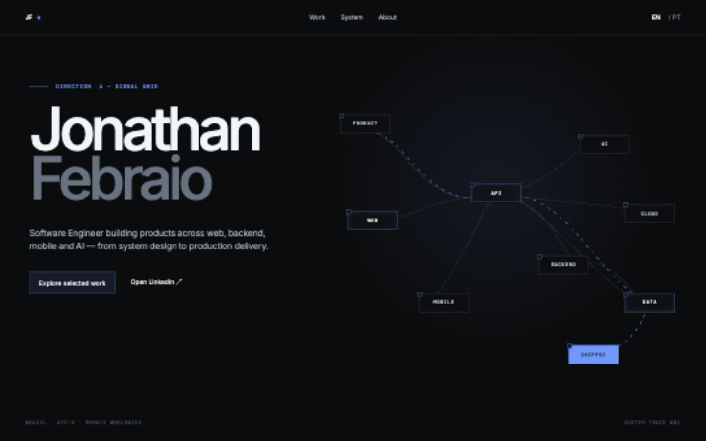
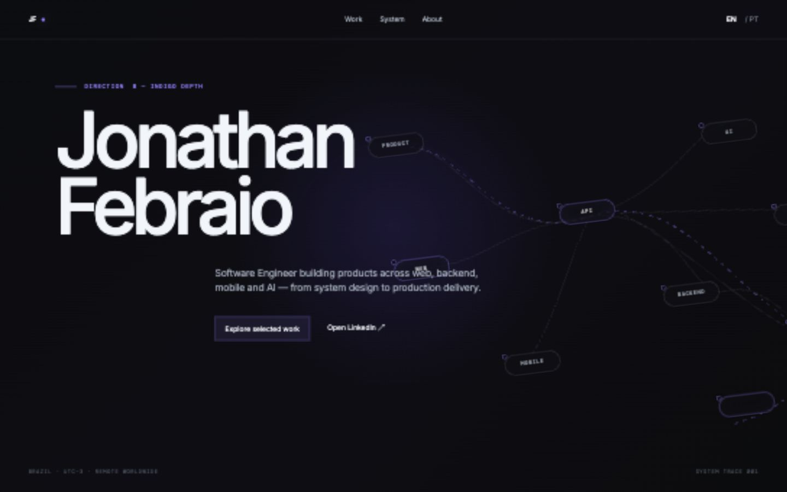
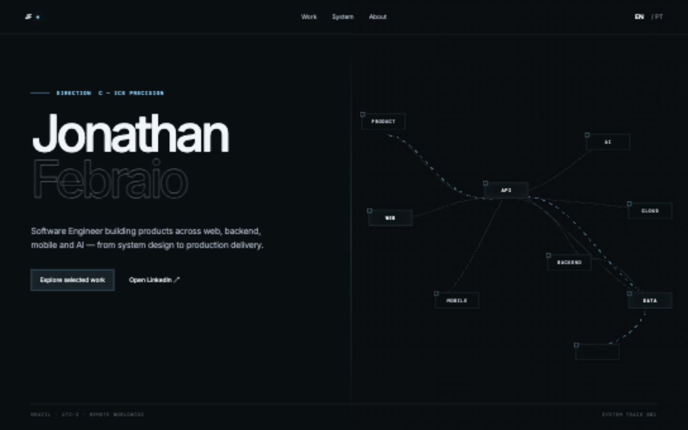

# Portfolio V3.1 — Hero Art Direction Comparison

Review date: 2026-08-30

## Visual thesis

A near-black software-product field crossed by a cool-blue execution trace, where architecture is not decoration: it is the narrative surface.

## Content plan

1. Hero — identity, role, short promise, living architecture, and one path to selected work.
2. Professional system — three anonymized domains morphing through one pinned architecture.
3. How I build — the same geometry reorganized into Web, Mobile, Backend, AI, and Platform modes.
4. Independent products — a small number of large product chapters with real screens and compact system flows.
5. Experience, about, and contact — concise proof and conversion.

## Interaction thesis

- A request travels from Product to Shipped during the hero entrance and the first scroll chapter.
- One shared architecture continuously morphs across three professional product domains.
- Engineering-mode controls rearrange, relabel, connect, and disconnect the same node field instead of swapping static copy.

## Direction A — Signal Grid

Strengths: clearest information hierarchy, strongest product-system reading, ample motion space, and the best balance between brand and architecture. The rectangular nodes can transform cleanly without looking ornamental.

Risk: the grid must remain subordinate and the blue must stay soft enough to avoid a cyberpunk result.

## Direction B — Indigo Depth

Strengths: strongest atmosphere and more spatial depth.

Risk: copy and architecture compete, the pill geometry feels less architectural, and the indigo field reduces system clarity.

## Direction C — Ice Precision

Strengths: disciplined geometry, cool material, and clear separation of identity from system.

Risk: the hard split and outlined surname are more familiar portfolio devices; the result is less ownable before motion begins.

## Selected direction

**Direction A — Signal Grid**, refined with Direction C's precision.

Selection reasons:

- The name remains unmistakable in the first viewport.
- The system has enough physical room for path drawing, node staging, and the request-to-shipped sequence.
- Shared rectangular geometry can become the professional-work and engineering-mode signature.
- It reads as a software product surface rather than a magazine, résumé, or decorative motion reel.
